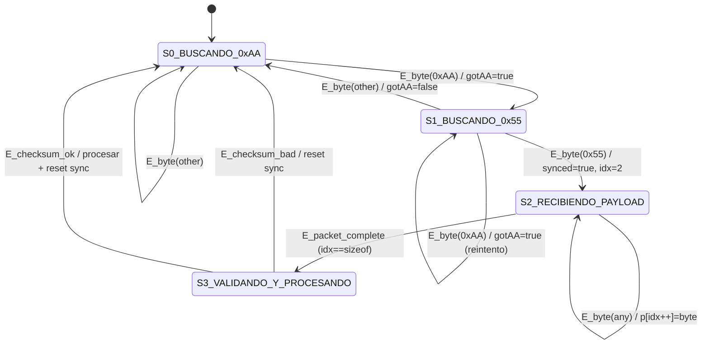

# Máquina de estados y protocolos de comunicación (UART + SPI)

Este documento describe el funcionamiento del sistema en **EDU-CIAA** (proyecto `my_programs/imu-and-buttons`), enfocándose en:

- La **máquina de estados** que permite recibir y reconstruir mensajes por UART.
- Cómo se usan los protocolos **UART** (ESP32 receptora → EDU-CIAA) y **SPI/SDI** (EDU-CIAA → VS1053B).

El objetivo es que puedas entender claramente **qué estados existen**, **qué eventos los disparan**, y **cómo se pasa de “llegó un rasgueo” a “suena un acorde MIDI”**.

---

## 1) Arquitectura rápida (qué habla con qué)

```
 ESP32 EMISORA  --(ESP-NOW)-->  ESP32 RECEPTORA  --(UART_232 115200)-->  EDU-CIAA  --(SPI/SDI)--> VS1053B

                           (manda ChordMessage)                      (parsea + agenda MIDI)       (sintetiza)
```

En este repositorio (`my_programs/imu-and-buttons`) estamos del lado **EDU-CIAA**.

---

## 2) Qué mensaje recibe la EDU-CIAA (ChordMessage)

Definido en `src/main.c`:

```c
typedef struct __attribute__((packed))
{
   uint8_t header1;    // 0xAA
   uint8_t header2;    // 0x55
   uint8_t botones[4]; // b0..b3 (acordes)
   uint8_t velocity;   // velocity MIDI
   uint8_t checksum;   // XOR de bytes [2..N-2]
} ChordMessage;
```

### Campos

- **`header1` + `header2`**: preámbulo fijo `0xAA 0x55`.
  - Sirve para “engancharse” al inicio real del paquete en un stream UART.
- **`botones[4]`**: 4 bits efectivos (0/1) que representan los botones.
  - En `src/chords_map.c` se convierten a un nibble `b = b3b2b1b0`.
- **`velocity`**: intensidad del rasgueo (0..127). Se usa directamente en `midiNoteOn()`.
- **`checksum`**: XOR de todos los bytes del payload (excluyendo headers y el propio checksum).
  - Permite detectar corrupción o desincronización.

### Tamaño y framing

El mensaje tiene **tamaño fijo** (8 bytes) y se envía en binario por UART.

---

## 3) Máquina de estados de recepción UART (en `src/main.c`)

Aunque no está implementada como un `enum State { ... }` explícito, la lógica se comporta como una máquina de estados. Se controla con estas variables:

- `bool synced` (si ya estamos dentro de un paquete)
- `bool gotAA` (si vimos el primer byte del preámbulo)
- `uint32_t idx` (cuántos bytes llevamos cargados en el struct)

### Estados

- **S0: BUSCANDO_0xAA**
  - Condición: `synced == false` y `gotAA == false`
- **S1: BUSCANDO_0x55**
  - Condición: `synced == false` y `gotAA == true`
- **S2: RECIBIENDO_PAYLOAD**
  - Condición: `synced == true` (ya vimos `0xAA 0x55`)
- **S3: VALIDANDO_Y_PROCESANDO**
  - Condición: `idx >= sizeof(ChordMessage)` (paquete completo)

### Eventos

- **E_byte(b)**: llegó un byte `b` desde UART (`uartReadByte(UART_232, &byte)`).
- **E_packet_complete**: se completó el buffer con `sizeof(ChordMessage)` bytes.
- **E_checksum_ok / E_checksum_bad**: resultado de validación.

---

## 4) Transiciones (qué hace pasar de un estado a otro)

### S0: BUSCANDO_0xAA

- **Entrada**: estado inicial, o luego de error.
- **Acción por byte**:
  - Si `byte == 0xAA` entonces `gotAA = true` → pasa a **S1**.
  - Si no, se queda en **S0**.

### S1: BUSCANDO_0x55

- **Acción por byte**:
  - Si `byte == 0x55`:
    - `synced = true`
    - `gotAA = false`
    - `idx = 0`
    - Se escriben los dos headers en el buffer: `p[0]=0xAA`, `p[1]=0x55`
    - Pasa a **S2**
  - Si `byte != 0x55`:
    - Si `byte == 0xAA`, se queda en **S1** (posible nuevo comienzo)
    - Si no, vuelve a **S0** (porque se perdió la secuencia)

### S2: RECIBIENDO_PAYLOAD

- **Acción por byte**:
  - Guardar byte: `p[idx++] = byte`
  - Si `idx >= sizeof(ChordMessage)` → pasa a **S3**

### S3: VALIDANDO_Y_PROCESANDO

1) **Validar checksum**:

```c
uint8_t chk = 0;
for (uint32_t i = 2; i < sizeof(ChordMessage) - 1; i++) {
   chk ^= p[i];
}

if (chk != msg.checksum) {
   // error
}
```

2) **Si checksum falla**:

- Se considera paquete inválido.
- Se resetea sincronización:
  - `synced=false`, `gotAA=false`, `idx=0`
- Vuelve a **S0**.

3) **Si checksum OK**:

- Se resetea sincronización para buscar el próximo paquete:
  - `synced=false`, `gotAA=false`, `idx=0`
- Se procesa el mensaje:
  - Botones → acorde
  - Velocity → fuerza
  - Se llama a `strumChord(chord, msg.velocity, now)`

---

## 4.1) Diagrama de máquina de estados (listo para draw.io)

Esta es la **misma máquina de estados** descripta arriba (recepción UART), pero expresada en un formato fácil de llevar a draw.io.

### Opción A: diagrama Mermaid (draw.io lo puede importar)

En draw.io podés usar:

- **Arrange → Insert → Advanced → Mermaid**

y pegar esto:



### Opción B: lista de nodos y transiciones (para dibujarlo a mano)

Si preferís dibujarlo manualmente en draw.io:

- **Nodos (estados)**
  - **S0_BUSCANDO_0xAA**
  - **S1_BUSCANDO_0x55**
  - **S2_RECIBIENDO_PAYLOAD**
  - **S3_VALIDANDO_Y_PROCESANDO**

- **Transiciones (flechas) sugeridas**
  - **S0 → S1**
    - Etiqueta: `byte==0xAA / gotAA=true`
  - **S0 → S0**
    - Etiqueta: `byte!=0xAA`
  - **S1 → S2**
    - Etiqueta: `byte==0x55 / synced=true; idx=0; p[0]=AA; p[1]=55`
  - **S1 → S1**
    - Etiqueta: `byte==0xAA / gotAA=true (nuevo intento)`
  - **S1 → S0**
    - Etiqueta: `byte!=0x55 && byte!=0xAA / gotAA=false`
  - **S2 → S2**
    - Etiqueta: `recv byte / p[idx++]=byte`
  - **S2 → S3**
    - Etiqueta: `idx==sizeof(ChordMessage)`
  - **S3 → S0**
    - Etiqueta: `checksum OK / procesar + reset sync`
  - **S3 → S0**
    - Etiqueta: `checksum BAD / descartar + reset sync`

---

## 5) Por qué se hace así en UART

UART **no** transmite “paquetes”; transmite un **flujo de bytes**. Problemas típicos:

- Si te conectás y empezás a leer “a mitad de stream”, no sabés dónde está el inicio del struct.
- Si se pierde un byte por overflow o latencias, el receptor queda desalineado y parsea basura.

Para hacerlo robusto:

- **Preámbulo 0xAA 0x55**: permite re-sincronizar.
- **Tamaño fijo**: una vez sincronizado, sabés cuántos bytes faltan.
- **Checksum XOR**: detecta corrupción/desalineación.
- **`while (uartReadByte(...))`**: drena el buffer y reduce overflow.

---

## 5.1) Justificación: por qué usar una máquina de estados para esta comunicación

En este sistema, usar una **máquina de estados (FSM)** para el parsing de UART es una de las decisiones más robustas y mantenibles, por estas razones:

- **UART es un stream, no paquetes**
  - No existe “inicio de struct” garantizado. La FSM permite buscar un patrón (`0xAA 0x55`) y re-sincronizar cuando sea necesario.

- **Resistencia a errores reales (pérdida de bytes / ruido / overflow)**
  - Si se pierde un byte, un parser “ingenuo” queda corrido para siempre.
  - Con FSM + preámbulo + checksum, el sistema **detecta el error** y vuelve a buscar un inicio válido.

- **No bloquea el loop principal**
  - En vez de hacer lecturas bloqueantes esperando “exactamente N bytes”, la FSM consume lo disponible (`while(uartReadByte...)`) y vuelve al loop.
  - Esto es clave porque el mismo loop debe seguir ejecutando `midiSchedProcess(now)` para que salgan los NOTE OFF a tiempo.

- **Claridad y testabilidad**
  - Los estados (S0..S3) son una especificación clara.
  - Podés testear transiciones alimentando bytes “artificiales” (incluyendo paquetes corruptos) y verificando que el sistema se recupere.

- **Escalabilidad**
  - Si mañana agregás campos al mensaje, o agregás un segundo tipo de mensaje, la FSM se extiende sin reescribir todo.

### ¿Es “la mejor” decisión?

Para este escenario (UART binario, mensajes cortos, necesidad de recuperación ante desincronización), **sí: FSM + framing (preambulo + checksum) es una de las mejores prácticas** en sistemas embebidos.

### Alternativas posibles (y por qué no se eligieron acá)

- **Leer N bytes fijos sin preámbulo**
  - Simple, pero frágil: si perdés 1 byte, todo queda desalineado y no se recupera.

- **Protocolo ASCII con delimitadores (por ejemplo `\n`)**
  - Fácil de debuggear “a ojo”, pero más costoso en ancho de banda y parsing.
  - No evita por sí solo la corrupción: igual necesitás checksum/CRC.

- **Protocolos estándar de framing (SLIP/COBS)**
  - Muy buenos y robustos, pero agregan complejidad.
  - Para un paquete fijo de 8 bytes, el preámbulo + checksum ya cubre el 90% del problema con menos código.

- **DMA + ring buffer + parser por índices**
  - Es la versión “industrial” para alto throughput.
  - Acá el bitrate/volumen es bajo, entonces la FSM con lectura byte-a-byte es suficiente y más simple.

---

## 6) Qué pasa cuando el paquete es válido (lógica musical)

### 6.1) Botones → acorde

En `src/chords_map.c`:

```c
uint8_t b = ((botones[3] & 1) << 3) |
            ((botones[2] & 1) << 2) |
            ((botones[1] & 1) << 1) |
            ((botones[0] & 1) << 0);

const ButtonChord *chord = getChordFromButtons(b);
```

`getChordFromButtons()` indexa `buttonChordMap[16]`.

### 6.2) Acorde → notas (tríada)

En `src/playing_chords.c`, `buildTriad()` construye 3 notas:

- Mayor: `root + {0,4,7}`
- Menor: `root + {0,3,7}`

### 6.3) “Rasgueo” (strum) en vez de bloque

`strumChord()` agenda las notas escalonadas:

- `STRUM_GAP_MS = 10` ms entre notas
- `NOTE_LEN_MS = 180` ms duración

En lugar de enviar 3 NOTE ON juntas, se simula el rasgueo de guitarra.

---

## 7) Máquina de estados “temporal” del scheduler (NOTE ON/OFF diferidos)

El archivo `src/midi_scheduler.c` implementa otra máquina de estados implícita: una **cola de eventos**.

Cada evento `MidiEv` tiene:

- `t` (timestamp ms)
- `type` (EV_ON / EV_OFF)
- `ch, note, vel`
- `used` (slot libre/ocupado)

### Estados conceptuales por evento

- **LIBRE** (`used=0`)
- **PENDIENTE** (`used=1`, pero `now < t`)
- **LISTO** (`used=1`, y `now >= t`) → se ejecuta y vuelve a **LIBRE**

### Por qué existe

Evita `delay()` para sostener una nota.

- Si usaras `delay(180)` para esperar el NOTE OFF, bloquearías la recepción UART.
- Con scheduler, el loop sigue leyendo UART mientras las notas se apagan “a tiempo”.

---

## 8) Protocolo UART (EDU-CIAA lado receptor)

### Configuración

En `src/main.c`:

- `UART_USB @ 115200`: consola/log.
- `UART_232 @ 115200`: entrada desde ESP32 receptora.

### Qué se manda realmente

La ESP32 envía **bytes binarios** del `ChordMessage`. No es texto.

### Consideraciones eléctricas

- UART en EDU-CIAA “UART_232” puede estar asociado a un transceptor RS-232 en algunos setups.
- Si hay inestabilidad, revisar:
  - Niveles (TTL vs RS-232)
  - GND común
  - Cableado TX/RX cruzado

---

## 9) Protocolo SPI/SDI hacia VS1053B (MIDI)

En este proyecto, la EDU-CIAA no “manda MIDI por UART” al VS1053B, sino que usa el modo **RT-MIDI** del VS1053B a través de su interfaz **SDI** (que viaja por SPI).

### Función clave: `sendMIDI()`

En `inc/midi_sdi.h`:

```c
static inline void sendMIDI(uint8_t b){
   sdiWrite16(0x00, b);
}
```

Esto escribe un “word” (16 bits) al VS1053B:

- alto: `0x00`
- bajo: `byte MIDI`

Ese formato corresponde al plugin RT-MIDI del VS1053B.

### Mensajes MIDI usados

- **Program Change** para elegir instrumento:

```c
midiProgramChange(0, 26);
```

- **Note On**:

```c
midiNoteOn(ch, note, vel);
```

- **Note Off**:

```c
midiNoteOff(ch, note, 64);
```

### Resultado

El VS1053B sintetiza audio a partir de esos mensajes MIDI.

---

## 10) Flujo completo resumido (de UART a sonido)

1. Llega un stream de bytes por `UART_232`.
2. Máquina de estados UART busca `0xAA 0x55`.
3. Lee 8 bytes y valida checksum.
4. Convierte `botones[4]` a nibble (0..15).
5. Busca acorde en `buttonChordMap`.
6. Llama `strumChord(chord, velocity, now)`.
7. `strumChord()` agenda eventos NOTE ON/OFF escalonados.
8. `midiSchedProcess(now)` ejecuta eventos cuando corresponde.
9. `midiNoteOn/Off()` → `sendMIDI()` → `sdiWrite16()` → SPI/SDI al VS1053B.
10. VS1053B genera el sonido.

---

## Estado de tarea

- Documento creado: `my_programs/imu-and-buttons/PROTOCOLOS_Y_MAQUINA_DE_ESTADOS.md`.
